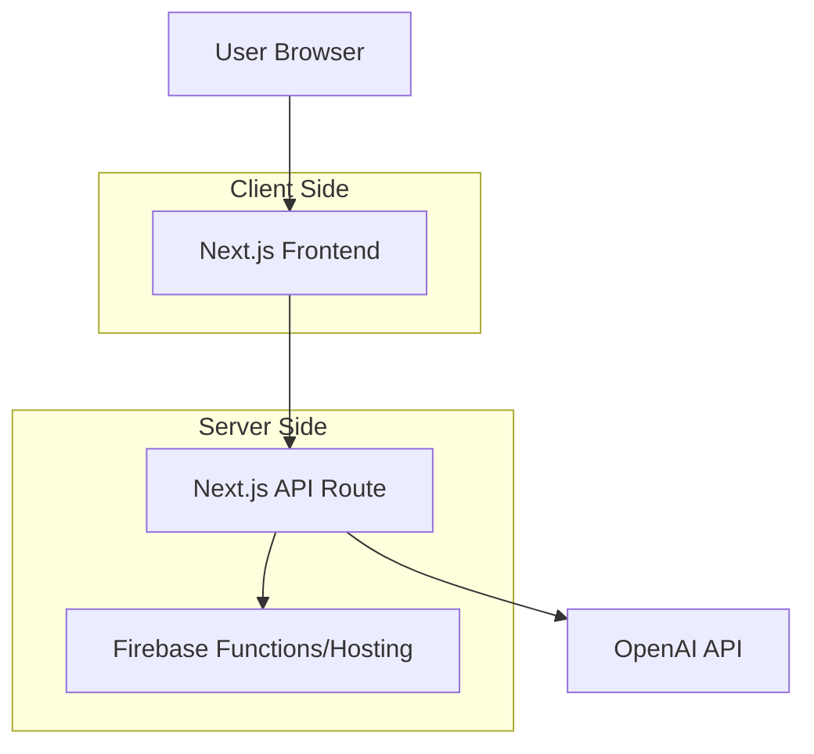

# Design Document

## Overview

The OpenAI Firebase Chatbot is a minimal, focused web application built with Next.js and React that provides a simple chat interface for users to interact with OpenAI's language models. The application follows a vertical slice approach, implementing the core chat functionality end-to-end with the simplest possible architecture.

## Architecture

### High-Level Architecture



### Technology Stack
- **Frontend**: React with Next.js 14+ (App Router)
- **Backend**: Next.js API Routes
- **Hosting**: Firebase Hosting (static export) or Firebase Functions
- **AI Service**: OpenAI API (GPT models)
- **Styling**: Tailwind CSS (minimal styling framework)

## Components and Interfaces

### Frontend Components

#### ChatInterface Component
- **Purpose**: Main chat UI container
- **Responsibilities**:
  - Render message history
  - Handle user input
  - Manage loading states
  - Display error messages

#### MessageList Component
- **Purpose**: Display conversation history
- **Responsibilities**:
  - Render user and bot messages
  - Auto-scroll to latest message
  - Distinguish between message types

#### MessageInput Component
- **Purpose**: Handle user message input
- **Responsibilities**:
  - Text input field
  - Send button
  - Form submission handling
  - Input validation

### API Interface

#### POST /api/chat
- **Purpose**: Process chat messages and return OpenAI responses
- **Request**:
  ```typescript
  {
    message: string;
    conversationHistory?: Array<{role: 'user' | 'assistant', content: string}>;
  }
  ```
- **Response**:
  ```typescript
  {
    response: string;
    error?: string;
  }
  ```

## Data Models

### Message Model
```typescript
interface Message {
  id: string;
  role: 'user' | 'assistant';
  content: string;
  timestamp: Date;
}
```

### Chat State
```typescript
interface ChatState {
  messages: Message[];
  isLoading: boolean;
  error: string | null;
}
```

### OpenAI Configuration
```typescript
interface OpenAIConfig {
  model: string; // default: 'gpt-4.1'
  temperature: number; // default: 0.7
  maxTokens: number; // default: 150
}
```

## Error Handling

### Client-Side Error Handling
- Network connectivity issues: Display retry option
- API errors: Show user-friendly error messages
- Input validation: Prevent empty message submission
- Loading states: Show spinner during API calls

### Server-Side Error Handling
- OpenAI API failures: Return structured error responses
- Rate limiting: Implement basic retry logic
- Invalid requests: Validate input parameters
- Environment variable validation: Check for required API keys

### Error Types
```typescript
enum ErrorType {
  NETWORK_ERROR = 'network_error',
  API_ERROR = 'api_error',
  VALIDATION_ERROR = 'validation_error',
  RATE_LIMIT_ERROR = 'rate_limit_error'
}
```

## Testing Strategy

### Unit Testing
- Component rendering tests using React Testing Library
- API route testing with Next.js test utilities
- Message formatting and validation logic tests

### Integration Testing
- End-to-end chat flow testing
- OpenAI API integration testing (with mocked responses)
- Error handling scenarios

### Testing Tools
- Jest for unit tests
- React Testing Library for component tests
- MSW (Mock Service Worker) for API mocking

## Deployment Configuration

### Firebase Hosting Setup
- Static export configuration for Next.js
- Firebase hosting configuration (`firebase.json`)
- Environment variable management for production

### Environment Variables
```
OPENAI_API_KEY=your_openai_api_key
NEXT_PUBLIC_APP_NAME=OpenAI Chatbot
```

### Build Configuration
- Next.js static export for Firebase hosting compatibility
- Tailwind CSS purging for minimal bundle size
- Production optimization settings

## Security Considerations

### API Key Protection
- Store OpenAI API key in server-side environment variables only
- Never expose API keys to client-side code
- Use Next.js API routes to proxy OpenAI requests

### Input Sanitization
- Validate and sanitize user input before sending to OpenAI
- Implement basic rate limiting on API routes
- Content filtering for inappropriate requests

## Performance Considerations

### Optimization Strategy
- Minimal bundle size through tree shaking
- Lazy loading of non-critical components
- Efficient state management with React hooks
- Optimized API response handling

### Scalability
- Stateless design for horizontal scaling
- Client-side conversation history management
- Minimal server-side processing requirements